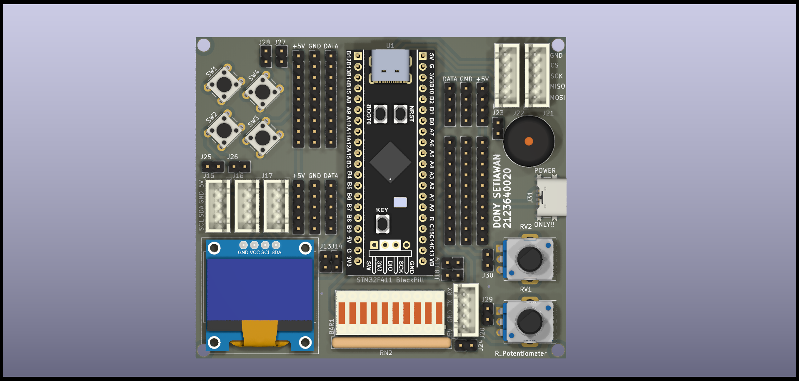
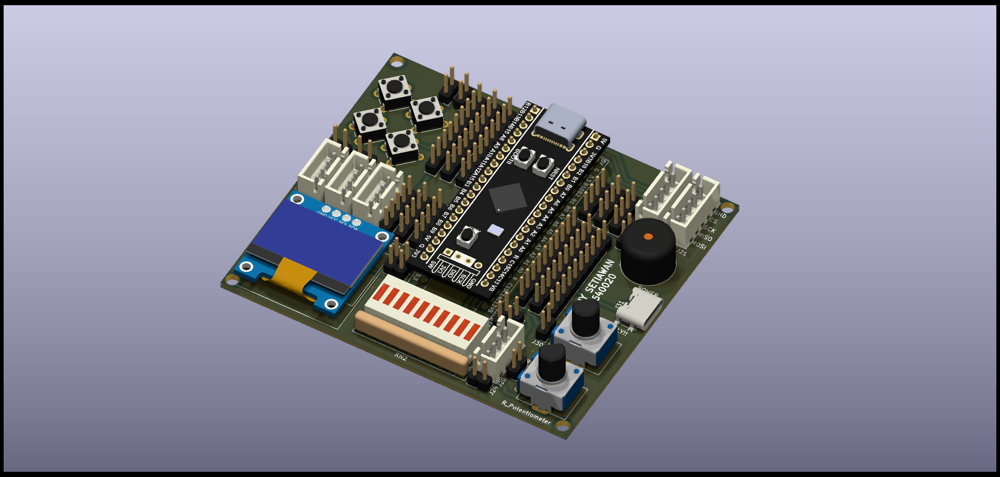

# Learning Board STM32 WeAct Blackpill V2
Repository ini berisi desain Learning Board untuk STM32 WeAct Blackpill V2. Learning board ini dirancang untuk memudahkan pembelajaran dan eksperimen dengan mikrokontroler STM32, khususnya varian Blackpill dari WeAct.

## Deskripsi
Proyek ini mencakup file desain menggunakan KiCad 7.0, yang meliputi:

.kicad_pro : File proyek utama KiCad.
.kicad_sch : Schematic desain rangkaian.
.kicad_pcb : Layout PCB.

## Requirement
KiCad versi 7.x atau yang lebih baru

## 3D Preview
  
  
